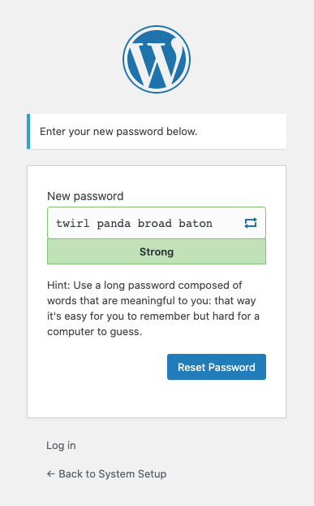

# Fuerte is a strong password generator with no dependencies

"Through 20 years of effort, we've successfully trained everyone
to use passwords that are hard for humans to remember, but easy
for computers to guess." — [XKCD](https://xkcd.com/936/)


Fuerte is a simple, strong password generator. 

It can create strong 
passwords that you should be using, because they're long and
easy to remember, like `correct horse battery staple`,
but it can also create the sorts of strong passwords that your bank
and your insurance company want you to use, because they're
complicated, like `Tr0ub4dor&3`.

In a pinch, it can even blend the two methods to create something 
like `correct!HORSE3battery%staple`, which, while difficult to
memorize, is at least equally difficult for a computer to guess.

The library is available for JavaScript and PHP projects, and if
you're using PHP, it installs easily into Laravel and WordPress
codebases. 

As of version `1.0.7`, both libraries use cryptographically secure 
random number generators.

## Need a new password right now?

You can experience Fuerte in action on [makepass.dev](https://makepass.dev). Enjoy!

## Quickstart Guide

There are two versions of Fuerte: one for JavaScript and one for PHP.
Both are a part of this codebase.

You can also use the PHP library as a WordPress plugin or as a Laravel
package. 

You only need one of these solutions for your project, but they 
can also be used together.

### Using the JavaScript library

The Fuerte package is available via NPM:

```bash
npm install @collegeman/fuerte
```

You can also just download this repository, place the uncompressed files 
among your project's assets, and then load the the library:

```html
<script src="/assets/fuerte/dist/fuerte-lib.js"></script>
<script>
  var password = fuerte().make() // a random, memorable password!
</script>
```

You can also load the library via jsdeliver:

```html
<script src="//cdn.jsdelivr.net/gh/collegeman/fuerte@1.0.7/dist/fuerte-lib.js"></script>
<script>
  var password = fuerte().make() // a random, memorable password!
</script>
```

Once added to your project, you can import Fuerte's API like this:

```js
import fuerte from '@collegeman/fuerte'
let password = fuerte().make() // a random, memorable password!
````

### Using the PHP library

The Fuerte package can be installed using Composer:

```bash
composer require collegeman/fuerte
```

Assuming there are no other functions in your codebase named `fuerte`, you can
use Fuerte like this:

```php
<?php
require __DIR__.'/vendor/autoload.php'; // bootstrap composer's autoloader
$password = fuerte()->make(); // a random, memorable password!
```

If a conflict exists preventing the helper function from being created, you
can access Fuerte via its facade:

```php
<?php
use Collegeman\Fuerte\Fuerte;
$password = Fuerte::make(); // a random, memorable password!
```

### Using the PHP library in a Laravel project

When installed via Composer into a Laravel project, an alias is created 
automatically, allowing you to access Fuerte from anywhere:

```php
<?php
$password = \Fuerte::make(); // a random memorable password!
```

The helper function `fuerte()` is also available.

### Using the PHP library in a WordPress project

If you're building a WordPress site on [Bedrock](https://roots.io/bedrock),
just install Fuerte into your project using Composer.

To install Fuerte into any other WordPress site, first download this repository,
then upload the uncompressed files into your site's `plugins` folder into
a subfolder named `fuerte`. Then, activate the plugin.

There are in-code configuration options. See [WordPress plugin configuration](#wordpress-plugin-configuration), below.
## Configuring the generator

Whether you are using the JavaScript library or the PHP one, Fuerte's API
is the same: it's fluent, allowing you to chain method invocations together
to configure the generator and then make a password, like this:

```js
let password = fuerte().memorable().separator('.').capitalize().size(6) 
// e.g., "hedge.pace.DIME.charm.onion.trick"
```

The same code, in PHP:

```php
<?php
$password = fuerte()->memorable()->separator('.')->capitalize()->size(6)->make();
// e.g., "snout.exit.SCUBA.watch.silly.hash"
```

Because the API is consistent across platforms, all remaining examples use the JavaScript version.

### Password type

Fuerte can generate three types of strong passwords: **memorable** (like `correct horse battery staple`), 
**random** (like `Tr0ub4dor&3`), and **PIN** (like `1234`). 

You can tell Fuerte what type of password you want just by
invoking the type name:

```js
fuerte().memorable().make() // e.g., "film rhyme stunt coat"
fuerte().random().make() // e.g., "TlCxbiKd"
fuerte().pin().make() // e.g., "476"
```

### Length/size

Password length matters: password length not complexity is what makes a password
hard for a computer to crack (see XKCD comic above). 

Each type of password has a minimum length. When you tell Fuerte what type of
password you want to generate, it will assume you want to use the minimum safe
length for that password. You can then tell Fuerte how long you want the password
to be using the `size()` method:

```js
fuerte().memorable().size(5).make() // use 5 words: "polo blush dug cola lance"
fuerte().random().size(32).make() // use 32 characters: "mSyDqEQwZkgdUINljHiJnLsaYcWbrOuK"
fuerte().pin().size(6).make() // use 6 digits: 386419
```

### Separators

By default, the **memorable** password type uses spaces to separate the words
in the password. You can tell it what you want the separator to be using
the `separator(string)` method:

```js
fuerte().memorable().separator('-').make() // "stark-jog-copy-lilac"
fuerte().memorable().separator('.').make() // "avoid.sleet.gas.view"
```

See *Symbols and Digits* below for more options.

### Symbols and Digits

Sometimes a system will require passwords to contain symbols or digits.

The **random** password type has two additional flags you can set: `symbols()`
and `numbers()`. These flags will ensure that the passwords generated
contain at least 1 of each special character:

```js
fuerte().random().numbers().make() // e.g., "1A2oPvxR"
fuerte().random().symbols().make() // e.g., "kQm#_xiA"
fuerte().random().numbers().symbols().make() // e.g., "ZCJhGO5%"
```

The **memorable** password type supports Symbols and Digits using the
`separator()` method. If you need a memorable password that contains
Digits, do this:

```js
fuerte().memorable().separator('0').make() // e.g., "chump9vixen6good9bud"
```

If you need a memorable password that contains Symbols *and* Digits, do this:

```js
fuerte().memorable().separator('0_').make() // e.g., "cramp2dill#grant1coach"
```

### Capitalization

If you need a memorable password that contains capital letters, use the
`capitalize()` method:

```js
fuerte().memorable().capitalize().make() // e.g., "slept taco START prior"
```

You can use `capitalize()` in combination with the `separator(string)` method
to create an almost-memorable password that also satisfies the goofy requirements 
for using complex characters: 

```js
let password = fuerte().memorable().capitalize().separator('0_').make() 
// e.g., "tusk9query*cross9DRAB"
```

## WordPress plugin configuration

By default, the WordPress plugin will have WordPress use Fuerte when it needs
to generate and display a suggestion for a new password, like on the password
reset screen:



Just click the reload button (either in the UI on the page or on the browser)
to get another suggestion.

If you don't want Fuerte to add these features to WordPress, just add the
following code to your theme's `functions.php` or to a must-use plugin file:

```php
<?php
add_filter('fuerte_style_passwords', '__return_false');
```

If you are using these features, you can customize the generator API using
a filter like this:

```php
<?php
add_filter('fuerte', function(\Collegeman\Fuerte\Generator $generator) {
  return $generator->random()->size(12)->symbols()->numbers();
  // ...but why would you want to make the passwords suck again?
});
```

## Support

If you find a problem with Fuerte, please post an [issue](https://github.com/collegeman/fuerte/issues) on GitHub.

## Credits

The inspiration for a cross-platform password generator with a consistent API
comes from the XKCD comic above as well as requirements from several of
the projects I'm working on at the moment. The image has been used without 
explicit permission.

The features of the generator were inspired and constrained by the 
minimal design of the password generator built into [1Password](https://1password.com/).
If you don't use a password manager, I highly recommend you give
1Password a try.

The word list used by Fuerte for generating memorable passwords belongs
to the [EFF](https://www.eff.org/deeplinks/2016/07/new-wordlists-random-passphrases).
It was used without permission.

<span>The photo of padlocks is by <a href="https://unsplash.com/@dynamicwang?utm_source=unsplash&amp;utm_medium=referral&amp;utm_content=creditCopyText">DynamicWang</a> on <a href="https://unsplash.com/s/photos/lock?utm_source=unsplash&amp;utm_medium=referral&amp;utm_content=creditCopyText">Unsplash</a></span>.

## License

Copyright 2020 Aaron Collegeman

Permission is hereby granted, free of charge, to any person obtaining a copy of this software and associated documentation files (the "Software"), to deal in the Software without restriction, including without limitation the rights to use, copy, modify, merge, publish, distribute, sublicense, and/or sell copies of the Software, and to permit persons to whom the Software is furnished to do so, subject to the following conditions:

The above copyright notice and this permission notice shall be included in all copies or substantial portions of the Software.

THE SOFTWARE IS PROVIDED "AS IS", WITHOUT WARRANTY OF ANY KIND, EXPRESS OR IMPLIED, INCLUDING BUT NOT LIMITED TO THE WARRANTIES OF MERCHANTABILITY, FITNESS FOR A PARTICULAR PURPOSE AND NONINFRINGEMENT. IN NO EVENT SHALL THE AUTHORS OR COPYRIGHT HOLDERS BE LIABLE FOR ANY CLAIM, DAMAGES OR OTHER LIABILITY, WHETHER IN AN ACTION OF CONTRACT, TORT OR OTHERWISE, ARISING FROM, OUT OF OR IN CONNECTION WITH THE SOFTWARE OR THE USE OR OTHER DEALINGS IN THE SOFTWARE.